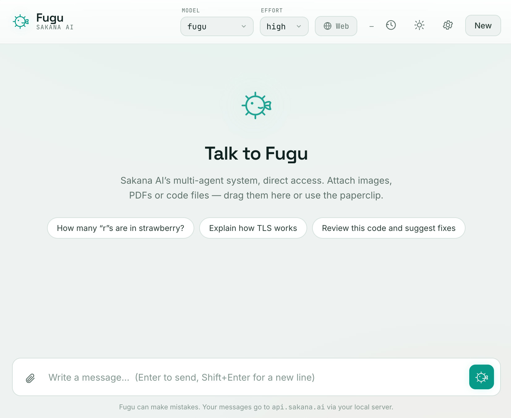

# 🐡 Fugu — UI client for the Sakana AI API



A lightweight, polished local web interface to chat with the **Fugu** models from [Sakana AI](https://console.sakana.ai). Send **files** (images, PDFs, code, text), built-in **web search**, model and reasoning-effort selection, and locally stored history.

The app runs entirely on your machine: a small Node server acts as a proxy to the Sakana API (your key stays server-side, never exposed to the browser) and serves the interface.

---

## ✨ Features

- **Streaming chat** — responses appear as they are generated, with Markdown rendering + syntax highlighting for code.
- **Attachments**:
  - 🖼️ **Images** (`.png`, `.jpg`, `.webp`, `.gif`) → analyzed by the model's vision.
  - 📄 **PDF** → text is extracted automatically and passed to the model.
  - 📝 **Code & text** (`.js`, `.py`, `.md`, `.json`, `.csv`, `.txt`, etc.) → injected into the context.
  - Drag-and-drop, image paste (Ctrl/Cmd+V), or the paperclip button.
- **Web search** — toggle it on with one click; the model can browse the web while answering (native Sakana tool).
- **Model selection**: `fugu`, `fugu-ultra`, `fugu-ultra-20260615`.
- **Reasoning effort**: `high` or `max` (xhigh).
- **Custom system instructions** and an adjustable token cap (in ⚙️ Settings).
- **Token tracking** — usage displayed in real time.
- **Light / dark theme** — toggle with one click (moon/sun icon), remembered; follows your system setting by default.
- **Local history** — your conversations are saved in the browser (localStorage); nothing leaves your machine.

---

## 🚀 Installation

Requirements: **Node.js ≥ 18** (tested on Node 22).

```bash
# 1. Install dependencies
npm install

# 2. Configure your API key
cp .env.example .env
#   then open .env and set SAKANA_API_KEY=...
#   (get your key at https://console.sakana.ai)

# 3. Run
npm start
```

Then open **http://localhost:3000** in your browser.

> 💡 You can also **leave `.env` empty** and enter your key directly in the interface (⚙️ Settings → API Key). It will then be kept in your browser for the session.

---

## 🔧 Configuration (`.env`)

| Variable           | Required | Default                       | Description                                  |
|--------------------|:--------:|-------------------------------|----------------------------------------------|
| `SAKANA_API_KEY`   | ✅ *(or via the UI)* | —                  | Your Sakana API key.                         |
| `PORT`             | ❌       | `3000`                        | Local server port.                           |
| `SAKANA_BASE_URL`  | ❌       | `https://api.sakana.ai/v1`    | API URL (only change if needed).             |

---

## 📜 Scripts

```bash
npm start    # start the server
npm run dev  # start with auto-reload (node --watch)
```

---

## 🏗️ How it works

```
Browser (interface)  ──►  Node/Express server  ──►  Sakana API (/v1/responses)
     public/                   server.js                 api.sakana.ai
```

- The server exposes a small local API: `/api/upload` (file handling via multer), `/api/chat` (SSE streaming to Sakana), `/api/test-key`, `/api/health`.
- It uses Sakana's **`/v1/responses`** endpoint (recommended, and the only one exposing the `web_search` tool).
- The official `openai` SDK is used in compatibility mode (the Sakana API is OpenAI-compatible).

### Technical details
- Backend: **Express 4**, **multer 2** (upload), **pdf-parse** (PDF extraction), **openai 4** (client), ESM.
- Frontend: HTML/CSS/JS with no build step, `marked` + `DOMPurify` (safe Markdown), `highlight.js` (code).
- Dark "abyss" theme, responsive, respects `prefers-reduced-motion`.

---

## ⚠️ Good to know

- The Sakana API is **stateless**: the full history is resent with every message. This is handled automatically.
- To keep browser storage small, **attachments are not kept after a page reload** — the text thread remains, but re-drop your files if you reload and then continue an old conversation.
- File size is capped (25 MB / file, 12 files, ~200,000 characters of extracted text) to stay reasonable.
- Your `.env` key is never sent to the browser; if you enter it in the UI, it stays in your `localStorage`.

---

## 📁 Structure

```
sakana-fugu-client/
├── server.js          # Express server (proxy + static)
├── package.json
├── .env.example       # configuration template
├── .gitignore
└── public/
    ├── index.html     # interface structure
    ├── styles.css     # theme
    └── app.js         # front-end logic (chat, upload, streaming)
```

---

Happy building 🐡
